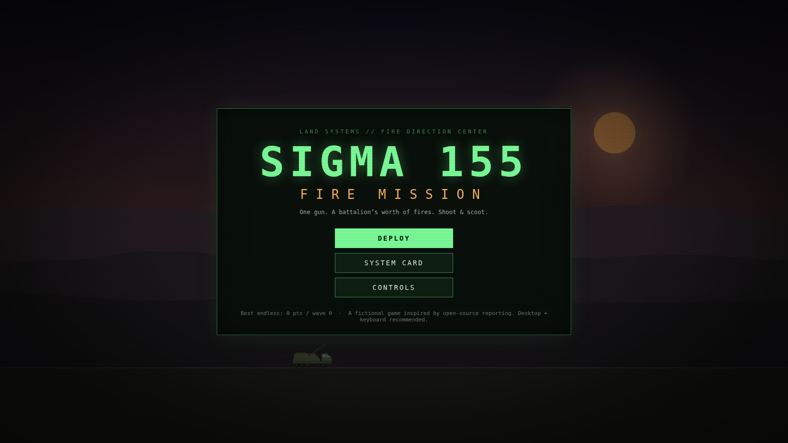
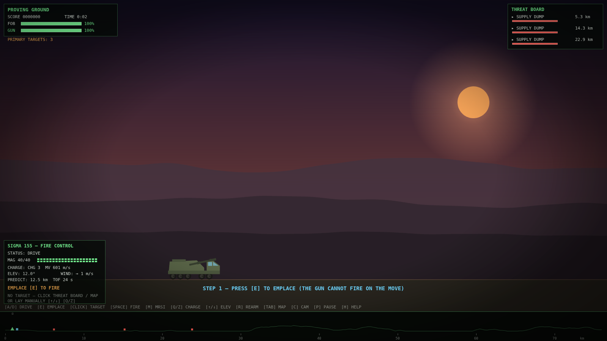
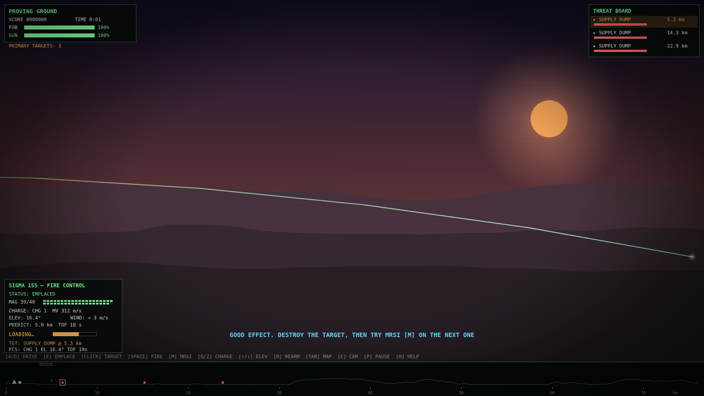
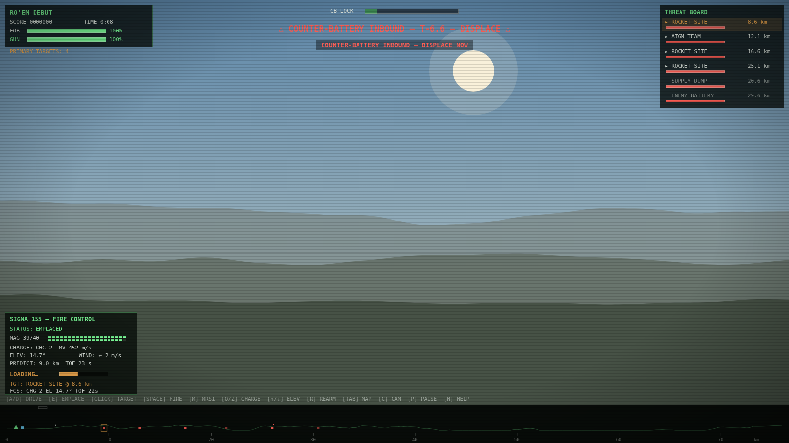
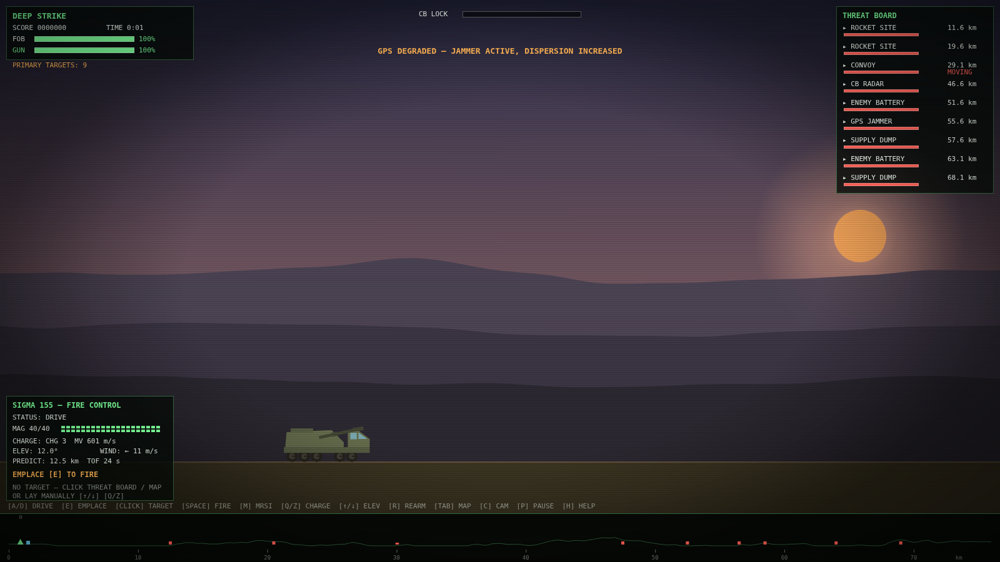

# SIGMA 155: FIRE MISSION

A browser-based artillery game built around the real characteristics of the Elbit **SIGMA 155**
self-propelled howitzer. One gun is supposed to deliver a battalion's worth of fires —
emplace, let the fire control computer lay the tube, empty the 40-round magazine into targets
up to 70 km downrange, and **displace before the counter-battery response arrives**.



> A work of fiction inspired by open-source reporting. In-game figures are drawn from
> manufacturer claims and trade press, compressed ~11:1 in time for gameplay.

## Play it

**No build, no dependencies.** Either:

- Open `index.html` directly in a desktop browser, or
- Serve the folder statically (avoids any local-file quirks):

  ```sh
  python3 -m http.server 8000      # or: npx serve
  # then open http://localhost:8000
  ```

It is also GitHub Pages-ready: enable Pages on this repository (deploy from branch, root)
and the game is live at the Pages URL.

Desktop keyboard/mouse gives the best experience; touch screens get on-screen controls.
Progress, upgrades, difficulty, and high scores persist in `localStorage`.

## How it plays



The core loop is **shoot and scoot**:

1. **Emplace** (`E`) — stabilizers down in seconds. The gun cannot fire on the move.
2. **Engage** — click a target on the threat board or map strip; the FCS picks the charge,
   solves elevation (wind- and altitude-compensated), and lays the gun. Fire with `SPACE`.
   Purists can lay manually (`↑/↓` elevation, `Q/Z` charge).
3. **MRSI** (`M`) — three rounds on different trajectories, timed to land simultaneously,
   for a damage bonus.
4. **Watch the CB LOCK bar** — every round you fire builds the enemy counter-battery radar
   track. Spotter drones overhead make it climb faster (your RWS engages them automatically).
   At full lock, a 5-round salvo lands on your registered firing position.
5. **Scoot** — displace at least 300 m and the salvo hits an empty grid square.
6. **Sustain** — rearm the full 40-round cassette (`R`) while stationary with stabilizers up.
   Keep rockets and convoys off the FOB; lose it (or the gun) and the mission fails.




### Modes

- **Campaign** — four missions following the real program record: a Yuma-style qualification
  shoot, the April 2026 combat debut, a night counterfire duel, and a 70 km deep strike with
  rocket-assisted projectiles. Each win lets you pick one upgrade (Iron Fist APS, Excalibur,
  XM1113 RAP, Lattice uplink, crew drill, cassette pre-stage) — each one tied to a fact from
  the system assessment.
- **Endless: "Battalion's Worth"** — escalating waves; how long can one gun do a battalion's job?

### Controls

| Key | Action |
|---|---|
| `A`/`D` or `←`/`→` | Drive (stabilizers up only) |
| `E` | Emplace / displace |
| Click target | FCS auto-lay (threat board or map strip) |
| `SPACE` / `F` / click | Fire |
| `M` | MRSI — multi-round simultaneous impact |
| `↑`/`↓` (+`SHIFT`) | Manual elevation |
| `Q`/`Z` or wheel | Charge select (CHG 6 RAP after upgrade) |
| `R` | Rearm full cassette |
| `TAB` | Tactical map view |
| `C` | Toggle shell-follow camera |
| `P`/`ESC` | Pause · `H` Help |

## Design: every spec is a mechanic

| Documented characteristic | In-game |
|---|---|
| Must stop and emplace to fire | Firing gated on EMPLACED state |
| ~45–60 s into action, seconds out | Emplace/displace timers |
| 40-round automated magazine | Magazine counter; cassette rearm |
| >8 rds/min burst, MRSI capable | Fire cooldown; MRSI planner |
| 4–40 km standard, 70+ km RAP (claim) | Charges 1–5; RAP unlock (verified by the in-repo ballistics tests) |
| 0.7% deviation accuracy (claim) | Dispersion model; Excalibur upgrade tightens it |
| 90-second counter-battery era | CB lock meter and answering salvos |
| ~15 min cassette resupply | Rearm timer |
| Iron Fist APS candidate / Lattice C2 | Upgrades |

See [`docs/GAME_DESIGN.md`](docs/GAME_DESIGN.md) for the full design and technical plan.

### Difficulty, jamming, and the resupply run

- **Threat level** (EASY / STANDARD / VETERAN) is selectable on every briefing screen and
  scales counter-battery pressure, enemy tempo, damage, and score.
- **GPS jammers** (mission 4 and endless waves) degrade FCS precision and knock Excalibur
  guidance offline until destroyed — the assessment's electronic-warfare question, made playable.
- **Resupply escort** (endless, every third wave): a cassette truck runs the gauntlet to the
  FOB while the rockets hunt it. If it arrives, your magazine refills instantly.



## Tech

**Rendering:** WebGL via a vendored PixiJS 8 (no CDN, no build step) draws the world —
additive-blended glows and tracers, mass particles, dynamic muzzle/explosion lighting,
retina resolution, per-mission color grading — while the original Canvas 2D engine renders
the HUD on a transparent layer above it and remains a full automatic fallback when WebGL
is unavailable (`?renderer=2d` forces it). Touch screens get on-screen controls and a scaled
HUD. Audio is fully synthesized with the Web Audio API, including a generative ambient score
whose tension layer swells with the counter-battery threat. Cinematic touches: hit-stop on
kills and slow-motion as MRSI volleys arrive.

Real-unit ballistics: gravity + quadratic drag + wind, integrated at 11× time compression,
with table-driven fire-control solvers (low/high arc, wind and target-altitude compensation,
MRSI scheduling).

## Tests

```sh
node test/ballistics_test.js     # solver/range-table sanity (no browser needed)

# full headless-browser playthrough (needs playwright + chromium):
PLAYWRIGHT_BROWSERS_PATH=<browsers> NODE_PATH=<global node_modules> node test/smoke.js
```

The smoke test runs two passes: a WebGL boot/visual pass, then a full deterministic
playthrough on the 2D fallback (headless GL is software-rendered and too slow for timing
assertions). It plays the tutorial (emplace → target → fire → MRSI), forces a counter-battery
exchange on mission 2, verifies the scoot mechanic and rearm cycle, and fails on any JS error.
Screenshots land in `test/shots/`.
